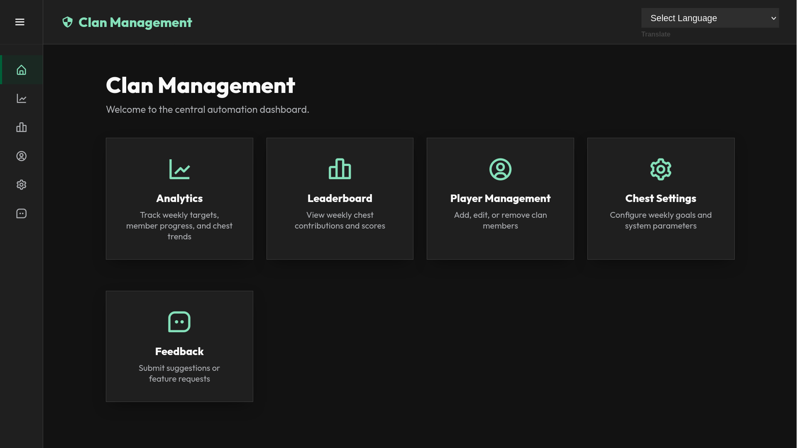
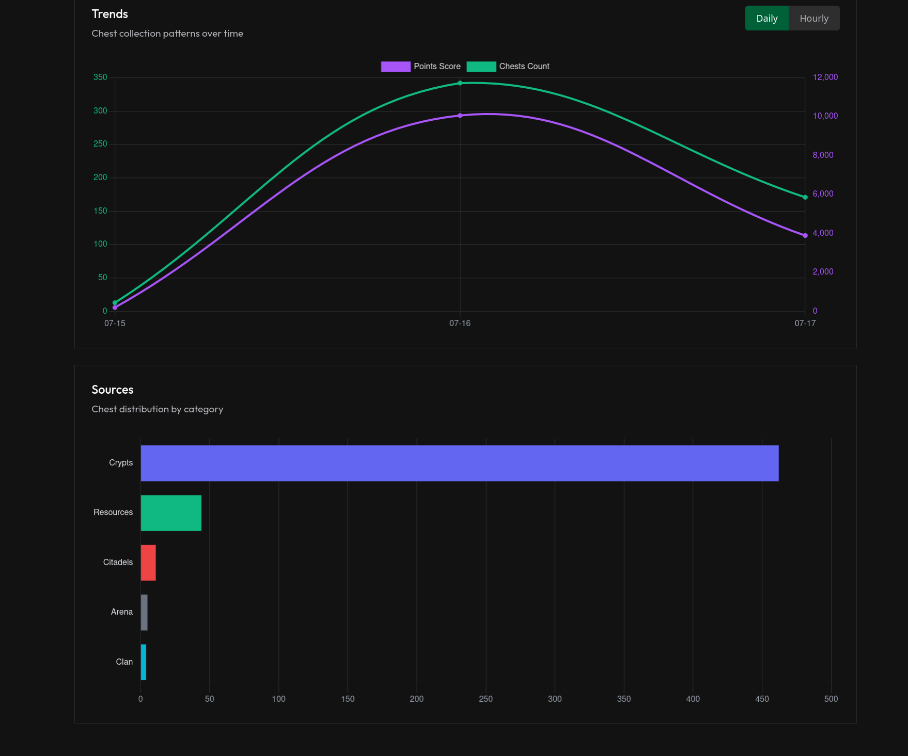
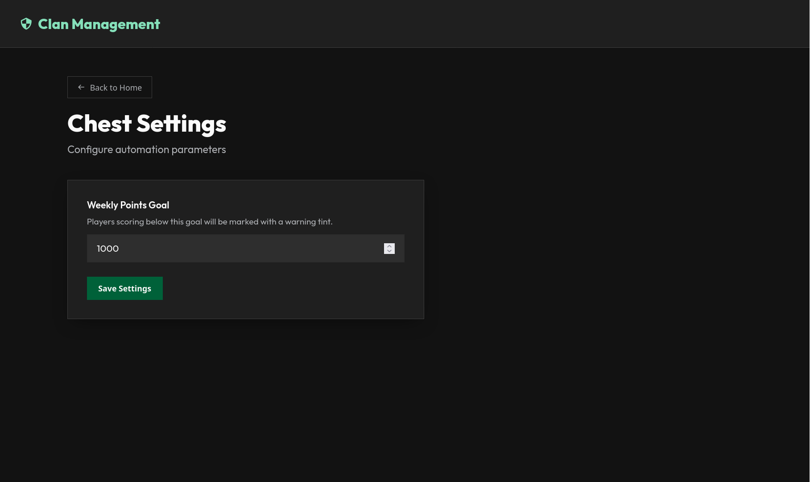

# Total Battle Chest Tracker & Analytics Dashboard

An automated, high-performance system designed to track clan chest contributions, analyze weekly targets, and manage player progress through a centralized web dashboard. This project automates the extraction and tallying of chest data directly from the game via ADB, storing it securely in a PostgreSQL database, and presenting the insights through a FastAPI-powered SPA (Single Page Application).

## Technology Stack


## System Architecture & Optimizations

This project was built to solve the fragility and latency inherent in traditional mobile game automation. Below are the core technical achievements and pipeline optimizations.

### 1. Asynchronous Extraction Pipeline
The most significant performance bottleneck in mobile automation is the delay between commanding the device, capturing the screen, and processing the image.
- **In-Memory ADB Framebuffer:** The system bypasses slow Android disk encoding entirely. By piping the raw, uncompressed framebuffer bytes directly from `adb exec-out screencap` into Python's RAM, the script achieves near-instantaneous screen captures as NumPy arrays.
- **Producer-Consumer Threading:** The architecture is decoupled into two parallel threads:
  - **The UI Driver (Producer):** Runs at maximum speed. It captures the screen, uses fast matrix slicing to crop the chest regions, pushes the raw image arrays into a thread-safe Queue, and instantly sends tap/scroll commands to the Android device.
  - **The OCR Worker (Consumer):** Runs quietly in the background, pulling images from the Queue and feeding them through the heavy EasyOCR neural network. This ensures the CPU can crunch OCR data at 100% capacity without ever blocking or slowing down the physical game interaction.

### 2. Overcoming the "Pixel-Fixated" Issue
Early versions of the automation relied on hardcoded absolute coordinates, which broke across different emulator resolutions or game updates.
- **Dynamic Template Matching:** The script utilizes `cv2.matchTemplate` to scan the screen for static anchor points (e.g., the Clan Logo or "Open" buttons). Once the anchor is located dynamically, it applies relative geometric offsets to perfectly bound and crop the text fields, regardless of scroll position or screen size.
- **Multi-Chest Batching:** Instead of capturing and reading one chest at a time, the engine identifies all visible chest cards in a single frame, slices them into individual arrays, and batches them into the asynchronous queue, drastically reducing overhead.

### 3. OCR and Text Parsing
Extracting text from a noisy, animated game background is highly error-prone.
- **EasyOCR / PyTorch:** Replaced generic legacy OCR with PyTorch-backed EasyOCR for highly accurate deep-learning-based text recognition.
- **Color-Based Level Detection:** For chests where the level number is omitted by the game, the system extracts the center pixel hue of the chest icon and matches it against a pre-loaded dictionary of chest colors (e.g., matching the exact purple pixel of a Level 15 chest).
- **Fuzzy Matching (`difflib`):** OCR strings are passed through Python's `difflib.get_close_matches` against the live PostgreSQL database of known clan members. If the neural network misreads `Fracassé LiFRAnor` as `Fracasse L!FRAnor`, the engine automatically corrects the string and logs the points to the correct database row, eliminating manual cleanup.

### 4. Database Engineering & API
- **Smart ID Re-use & Sequences:** The PostgreSQL database ensures data integrity through unique constraints. The REST API utilizes `generate_series` and `LEFT JOIN` queries to automatically discover and reuse fragmented primary keys when creating new players, preventing ID sequence desynchronization.
- **SQL Aggregation:** The FastAPI server offloads complex point aggregations to the database engine. Instead of iterating through thousands of rows in Python, it uses SQL Common Table Expressions (CTEs) to group, sum, and format leaderboard data before serving it to the frontend.

### 5. Glassmorphism Web Dashboard
- **Vanilla SPA:** The entire frontend is built as a highly responsive Single Page Application using pure JavaScript and CSS, avoiding the overhead of heavy frameworks.
- **Live Search & Filtering:** The Player Management tab features a real-time event listener that filters the active DOM dynamically based on Rank dropdowns and textual search queries simultaneously.
- **Data Visualization:** Integrated Chart.js to render interactive analytical components (Doughnut charts for member distribution, Line graphs for daily collection trends).

## Screenshots

### Main Dashboard & Analytics

Provides a high-level summary of the clan's weekly progress, showing exactly who is on track and who needs attention.

### Chest Frequency Trends

Tracks the volume and score of collected chests over time, grouped by daily or hourly intervals.

### Goal Setting & Configuration

Easily update the weekly automation parameters to adjust clan requirements.

## Installation & Setup

### 1. Prerequisites
- Python 3.10+
- PostgreSQL database
- ADB (Android Debug Bridge) enabled emulator/device

### 2. Environment Configuration
Create a `.env` file in the root directory:
```env
DB_HOST=localhost
DB_NAME=tb_automation
DB_USER=tb_user
DB_PASS=your_password
DB_PORT=5432
```

### 3. Running the Automation
Connect your Android device via ADB and run the asynchronous extraction script. On its first run, it will automatically launch a calibration wizard to adapt to your screen resolution.
```bash
python chest-tracker/extractor.py
```

### 4. Running the Dashboard
Start the FastAPI backend server:
```bash
python chest-tracker/app.py
```
Access the dashboard via your web browser to manage players, view the leaderboard, and monitor analytics in real-time.
